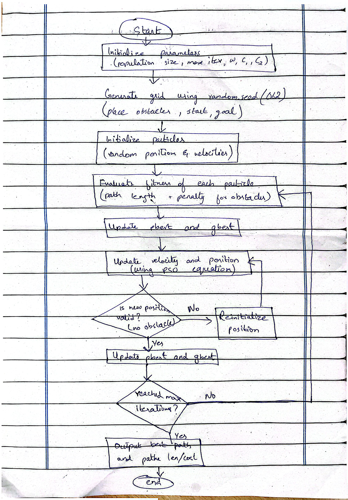

# Swarm-Based Path Planning with Obstacles (Assignment 1)

* **Name:** Esha Sattar
* **Roll Number:** 062
* **Seed Used:** 62

## Short Description of Approach
This project implements Particle Swarm Optimization (PSO) to compute an optimal, obstacle free trajectory across a programmatically generated 2D grid. The roll number (062) acts as the fixed random seed for reproducibility. Each particle represents a candidate path consisting of intermediate waypoints. The objective function evaluates path length combined with a heavy penalty score for any collisions with obstacle cells, iteratively guiding the swarm toward the optimal collision free path.

## How to Run the Code
1. Clone the repository:
   ```bash
   git clone [https://github.com/eshasattar/Swarm-lab-assignment-1](https://github.com/eshasattar/Swarm-lab-assignment-1)

   ## Algorithm Flow Diagram
